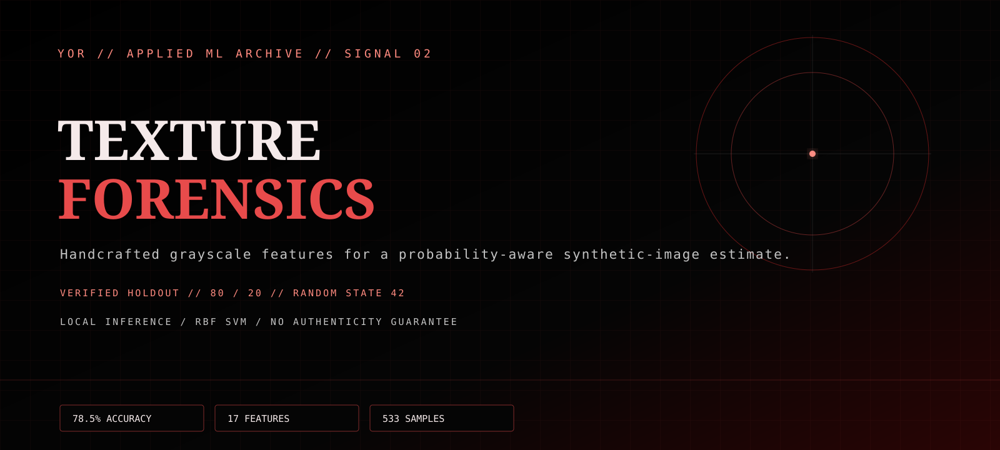
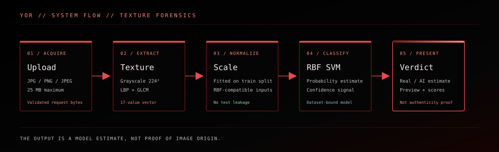

# YOR // Texture Forensics



`VERIFIED HOLDOUT` · `LOCAL INFERENCE` · `CLASSICAL ML`

Texture Forensics is a small image-classification system that extracts grayscale texture, noise, and structure features before scoring them with an RBF Support Vector Machine. It is a research/demo detector, not an authenticity oracle: images outside the curated dataset can produce confident mistakes.

## Current evidence

The reproducible evaluation is [`outputs/model-evaluation.json`](outputs/model-evaluation.json). It uses the checked-in dataset, a deterministic stratified 80/20 split, `random_state=42`, an RBF SVM, and a scaler fitted on the training partition only.

| Measure | Result |
| --- | ---: |
| Total supported samples | 533 |
| Real / AI samples | 258 / 275 |
| Train / holdout samples | 426 / 107 |
| Held-out accuracy | 78.5% |
| Feature vector length | 17 |

This is one holdout from one curated dataset. It is not a universal detector benchmark, and the result should not be used to make consequential decisions about an image or its creator.



## Product surface

- A Flask page at `/` for a simple multipart upload flow.
- A JSON endpoint at `POST /api/predict` for the same local inference path.
- A Streamlit/Three.js control-room surface in [`app.py`](app.py), using the shared [YOR visual token contract](design/yor-tokens.json).
- Upload validation for JPG, JPEG, and PNG files with a 25 MB limit.
- Confidence and estimated AI probability are shown as model outputs, not proof of provenance.

## Feature and inference flow

1. Decode the image, convert to grayscale, and resize it to `224 × 224`.
2. Extract variance, Laplacian high-frequency variance, uniform LBP histogram values, GLCM contrast, energy, homogeneity, correlation, and entropy.
3. Standardize the 17-value vector with the checked-in scaler.
4. Run the checked-in RBF SVM and expose the estimated AI probability plus confidence.

## Run locally

```powershell
python -m pip install -r requirements.txt
python scripts/evaluate_model.py
python -m flask --app index run --debug
```

For the Streamlit surface:

```powershell
python -m streamlit run app.py
```

The committed model artifacts are `svm_model.pkl` and `scaler.pkl`. The dataset directory is checked in for reproducibility; verify the source and licensing records before redistributing it.

## Source and limitations

- The dataset is split into `dataset/real` and `dataset/ai`; the README’s source description is retained from the project history and should be expanded with exact source/licensing records before broader redistribution.
- The evaluation is image-level and dataset-specific. It does not establish robustness to new generators, compression, screenshots, edits, social-media transforms, or adversarial examples.
- Confidence is derived from the model’s probability/decision output. It is not calibrated as a real-world probability of authorship.
- The model uses handcrafted grayscale features. The project does not claim deep-learning performance, provenance detection, or forensic certainty.
- The Flask page processes the uploaded bytes for the request and does not advertise durable storage or a hosted production service.

## Repository map

- [`inference.py`](inference.py) — upload validation, feature extraction, model loading, and prediction formatting.
- [`index.py`](index.py) — Flask page and API route.
- [`app.py`](app.py) — Streamlit control-room interface.
- [`scripts/evaluate_model.py`](scripts/evaluate_model.py) — deterministic evaluation and JSON evidence artifact.
- [`outputs/model-evaluation.json`](outputs/model-evaluation.json) — current evaluation snapshot.
- [`assets/`](assets/) — code-native YOR hero and architecture diagrams.

## Status

`DEMO / LOCAL INFERENCE`

This project is an applied-ML and interface experiment. It is not a security, identity, hiring, moderation, or financial decision system.
